# ReadMe - Project 3 (Software Seller)

** **

## Description

This project was undertaken in week 8/9 of the course at the end of the introduction to MongoDB & full stack module. 

The brief was to create a full stack application (front-end and back-end including a non-relational database) using the MERN (MongoDB, Express, React, Node) stack with Sass styling and deployed using Heroku.

We decided to create a second hand software selling auction site themed like Windows XP. Not only would this allow us to explore virtual fields in depth but we would be able to heavily utilise concepts such as state to create a dynamic, highly functional front end…. that looked like it was from the noughties.

## [Deployment link](https://software-seller-phil-eda9828bad1a.herokuapp.com/login)

## Getting Started/Code Installation

1. [GitHub Repo](https://github.com/philiphart1006/Software-Seller-forked) >> 
2. Download directory >>
3. Server side:
    1. npm install in root directory
    2. npm run serve
4. Client side (Cd to client directory)
    3. npm install 
    4. npm run dev
5. Open local host in local browser

## Timeframe & Working Team

This project was undertaken as a pair over the course of 7 working days: Wednesday afternoon - Friday morning.

## Technologies Used

### Front End

* Vite
* Axios
* Sass (React-Bootstrap, Bootstrap, & Chakra UI)
* JavaScript (React, React-Router-Dom)

### Back End

* MongoDB
* Mongoose
* Express
* JSON Web Token (jwt.io)
* bcrypt

### Planning & resources

* Figjam
* Figma
* Trello
* Google Forms & Zapier
* DALL-E
* XP Styling:
    * Xp.css
    * XP icons
    * XP visual guidelines
    * Personal sites

## Brief

### “Technical Requirements

* Build a full-stack application by making your own backend and your own front-end
* Use an Express API to serve your data from a Mongo database
* Consume your API with a separate front-end built with React
* Be a complete product which most likely means multiple relationships and CRUD functionality for at least a couple of models
* Implement thoughtful user stories/wireframes that are significant enough to help you know which features are core MVP and which you can cut
* Have a visually impressive design to kick your portfolio up a notch and have something to wow future clients & employers. ALLOW time for this.
* Be deployed online so it's publicly accessible.

### Necessary Deliverables

* A working app hosted on the internet
* A link to your hosted working app in the URL section of your Github repo
* A git repository hosted on Github, with a link to your hosted project, and frequent commits dating back to the very beginning of the project
* A readme.md file with:
    * An embedded screenshot of the app
    * Explanations of the technologies used
    * A couple paragraphs about the general approach you took
    * Installation instructions for any dependencies
    * Link to your user stories/wireframes – sketches of major views / interfaces in your application
    * Link to your pitch deck/presentation – documentation of your wireframes, user stories, and proposed architecture
    * Descriptions of any unsolved problems or major hurdles you had to overcome”

## Planning

### Brainstorming

As this was my first pair/group project, collaboration was super key - both in the initial planning and subsequent execution stages. To start with, we used an AI generated Figma jam board to come up with ideas and build them into an MVP on paper.

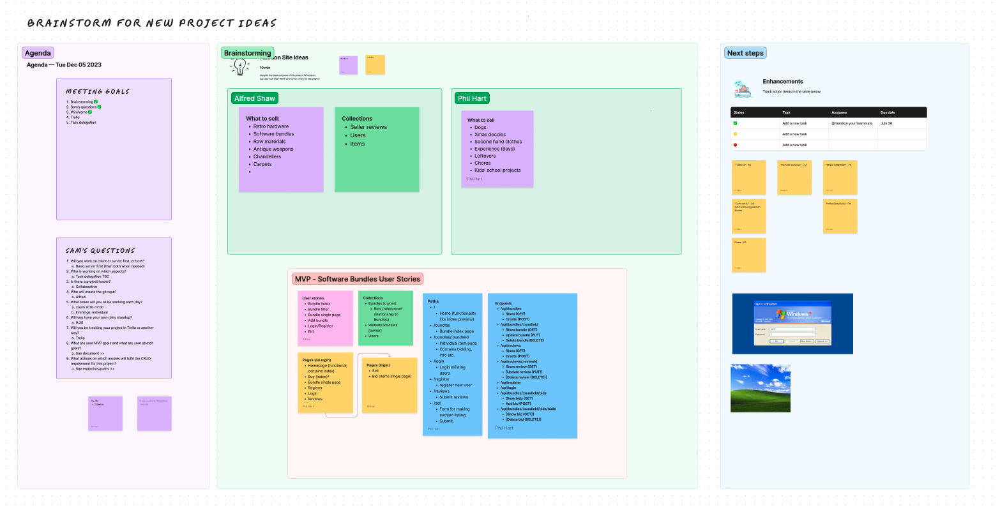

I also created a basic entity relationship diagram in LucidChart to show the structure of our database.

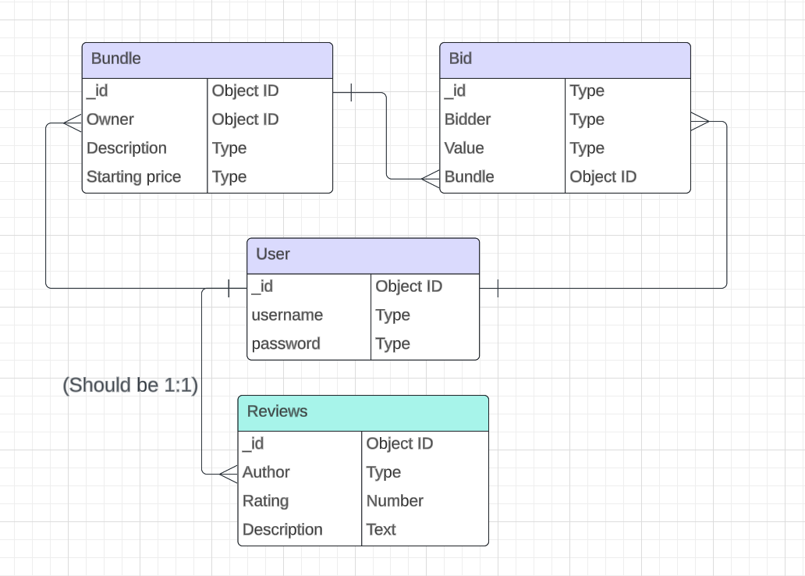

### Project management

Once again using a template Trello board, we split the application functionality and coding into separate _user stories_. User stories were split into front and back end build requirements. This helped us pseudocode & split out functionality into different components as well as easily assign & track who was working on what.

Largely, we each worked on both front & back-end code and would often build the front end components relevant to the back-end parts we’d coded. We would pair-code when faced with particularly challenging areas or where we both wanted an understanding of how that code worked - either for our own curiosity, to utilise that code ourselves, or for inspiration elsewhere.

We also included columns for bugs & enhancements. 

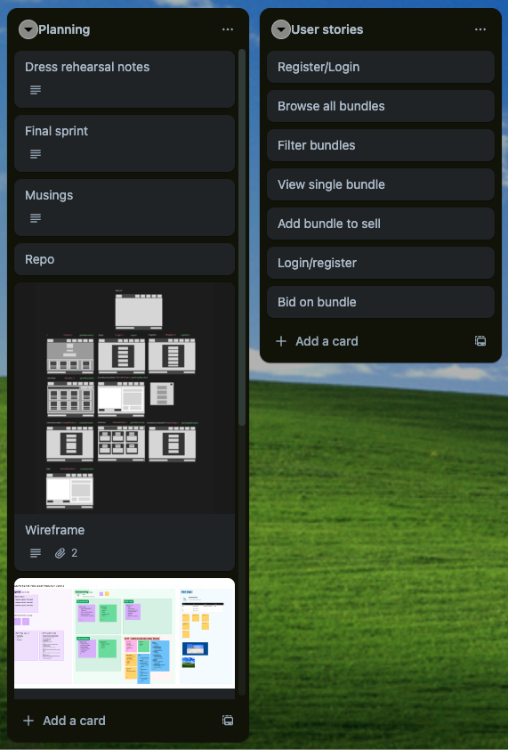

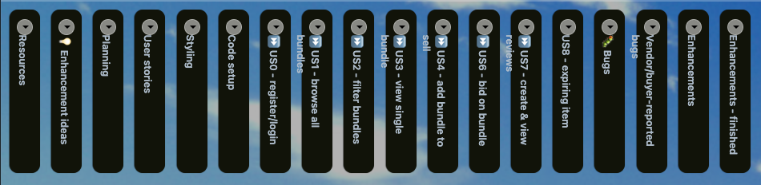

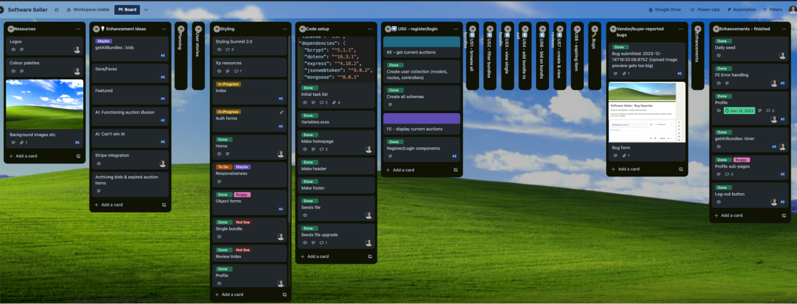

### Design

#### Wireframe

I utilised Figma here to draw out the wireframes with all HTML elements. Grouping elements, I was able to map out the pages with their relevant paths, components, loaders, and/or actions.

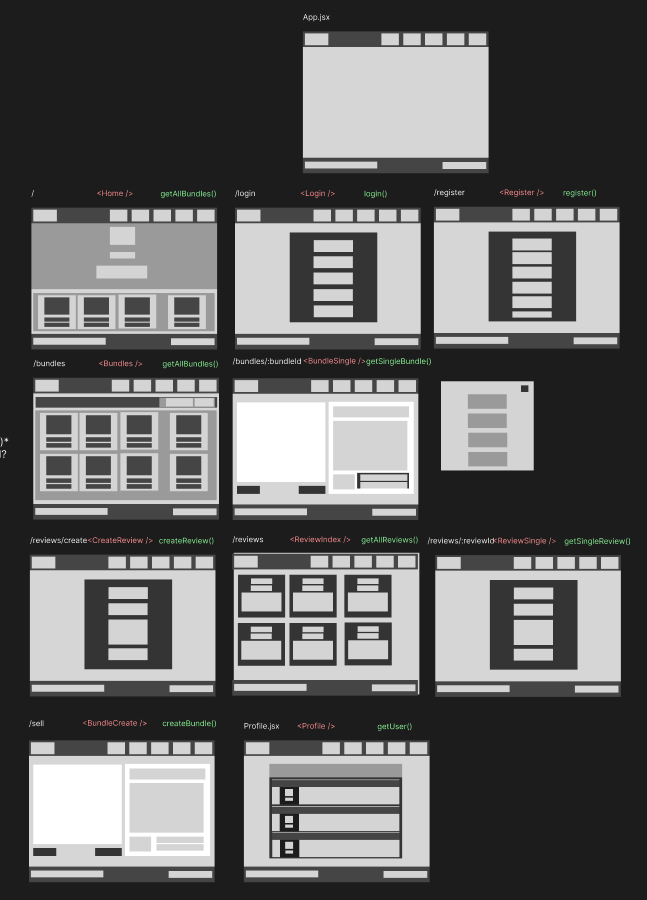

#### Resources

We utilised various licence-free sites for resources such as images & AI-generated logos/favicons. In addition, we used a selection of XP resources from both individuals and Microsoft themselves which were heavily credited within the deployment:

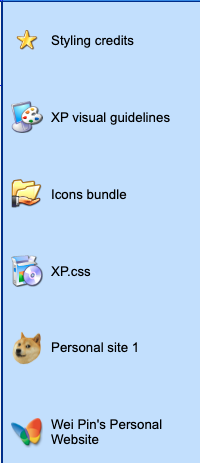

## Build/Code Process

__N.B. Coding snippets & highlights can be found outlined in further detail in Wins/Challenges/Key Learnings.__

_Following day 1, I have only included tasks completed by myself/collaboratively*._

#### Day 1 (Wednesday 6th December)

* Brainstorming/planning as above
    * Own tasks:
        * Setting up, sharing, completing Figjam
        * Figma wireframe
        * Trello board for project management
* Setting up Repo with development/feature branches
    * Own tasks:
        * Forking a feature branch for my own modifications
* Start Front End
    * Own tasks
        * Create header, fotter, home components
        * Add global styling variables

#### Day 2 (Thursday)

* BE
    * Controllers (bids)
    * Routes (bids/review)
    * Schema update (bundle)
    * Seeding data & functions (bids/reviews)
* FE
    * Initial loaders
    * BundleSingle JSX component
    * Create bid process

#### Day 3 (Friday)

* FE
    * Adds timer & max bid to single bundle (see: Wins)
    * Create bid JSX component
    * Create/edit/delete bundle functionality for bundle

#### Day 4 (Monday 11th)

* BE
    * Extended seed data & functions
* FE
    * Fixed image upload functionality within create/edit bundle (see: Challenges)

#### Day 5 (Tuesday)- soft MVP & styling deadline

* BE:
    * Profile endpoints
* FE:
    * Profile components
    * Styling: taskbar styling

#### Day 6-8 (Wednesday-Friday am)

* Styling polishing (see: Key learnings/takeaways)
* Bug fixes (see: Bugs)
* Code refactoring

## Challenges

#### Image Uploads

A cloud-based image storing site (Cloudinary) to allow vendors to upload images of their bundle being sold. The Cloudinary URL would then be stored in the image field within the MongoDB bundle document. We worked on this part together as it hadn’t been covered fully in class so we wanted to troubleshoot together.

The process for this can be seen within client >> src >> components >> CreateBundle.jsx

1. Set form data to state

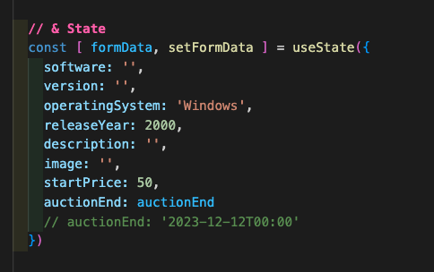

2. Update formData when image is uploaded & URL returned from Cloudinary

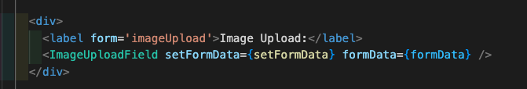

3. Two functions that will a) update all the formData when a form field is changed and b) on submission will create a bundle with the updated formData

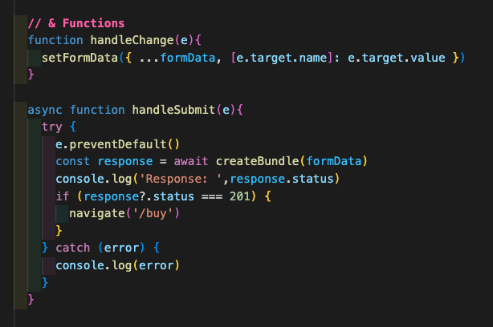

## Wins

#### Automatic timers

In order to get the timer to tick, I had to set the time remaining on an auction to state and then run a setInterval with a period of 1000ms.

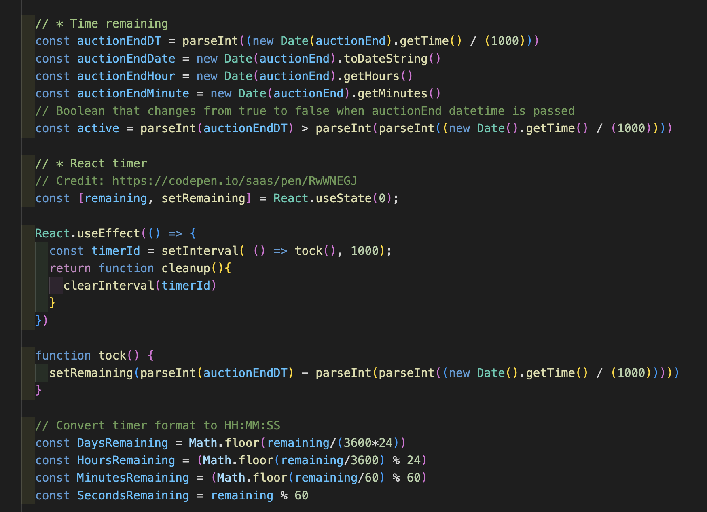

I was able to set one variable to state/use just one setIinterval even on the page with multiple timers and each timer would successively “tick” at an interval of exactly one second.

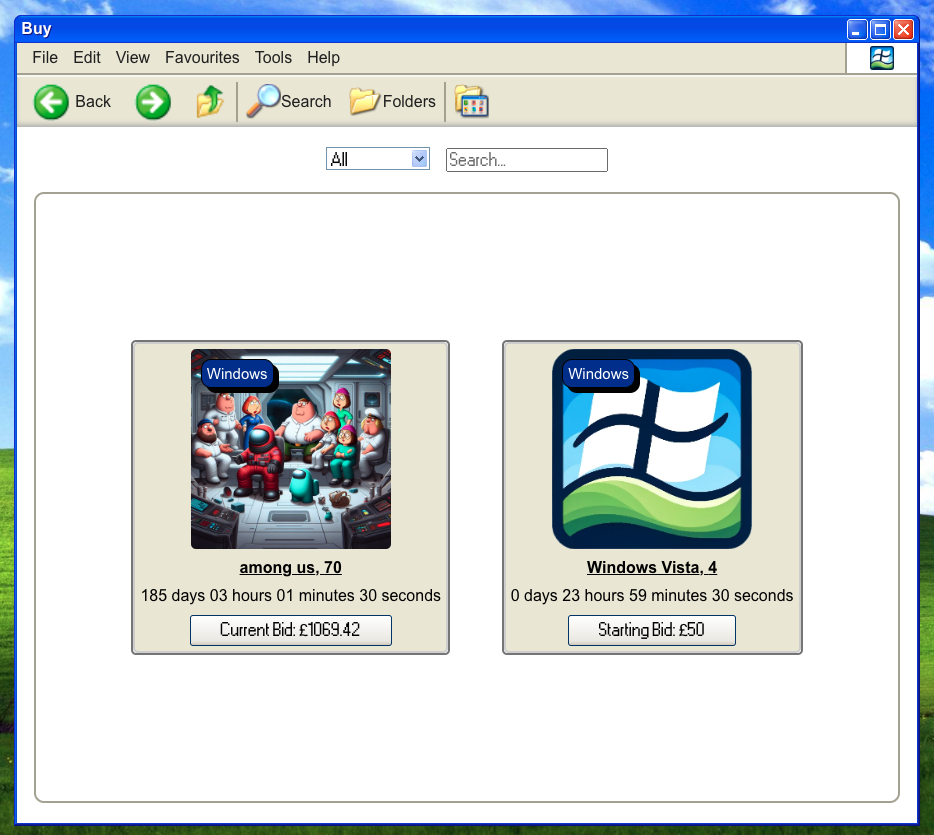

## Key Learnings/Takeaways

#### Styling, Packages, & Responsiveness

While at first we had hoped the xp.css package would provide us with the XP styling framework, we soon found this was far from the case and the final product is a hybrid combination of shared resources and pure grit.

In addition, we agreed that we wouldn’t stretch to making this site mobile responsive as it was better to focus on clean, bug-free functionality than making XP mobile friendly! Going forward, I would prioritise mobile functionality over retro theming but we had fun!

When looking at narrow screens, there were a few core changes we had to do:

* Remove left-side nav
* Shorten personal website hyperlinks in bottom toolbar, remove clock
* When logged out, add a login button next to the bug logo otherwise users would be trapped

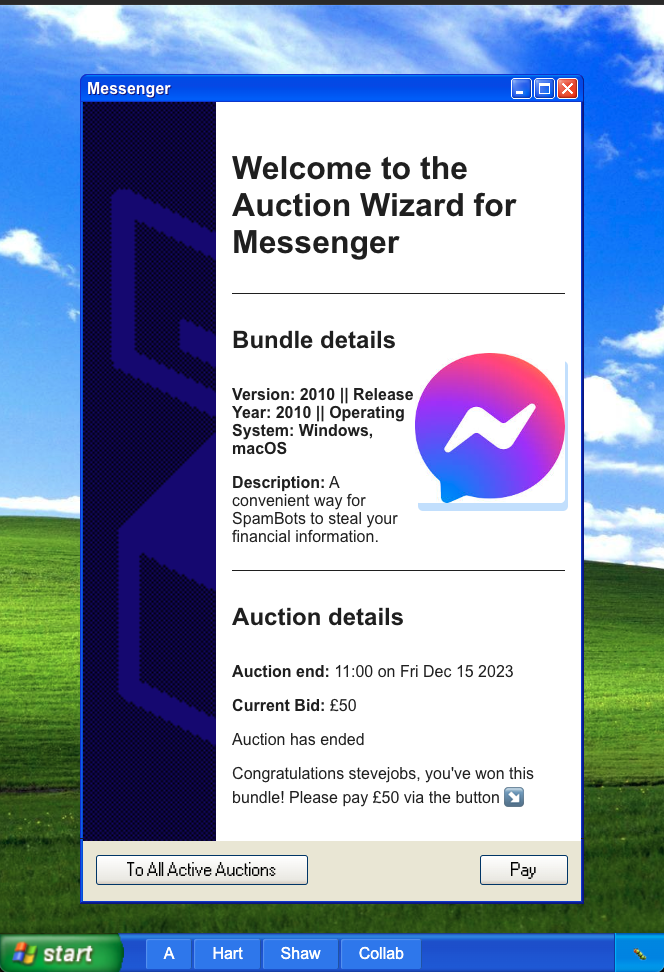

#### Committing & working on different branches

This was my first time developing on a feature branch and committing/merging with the main branch. While it took a while to fully understand conceptually what was happening with different branches/how that reflected on my local machine, we managed to avoid any severe merge conflicts.

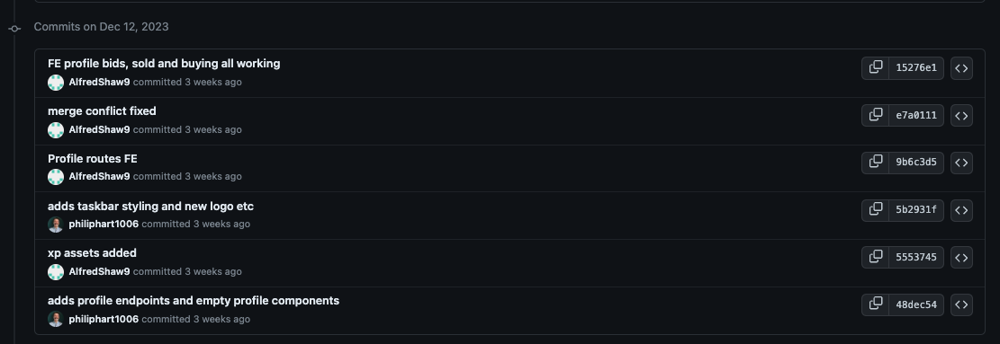

## Bugs

#### Resolved bugs

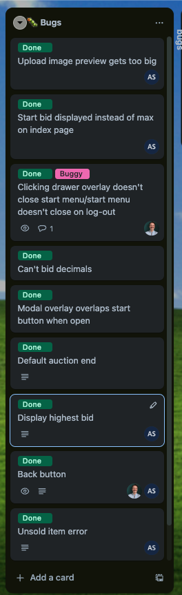

#### Unresolved bugs

_Watch this space! Vendor/buyer reported bugs will appear via [this form](https://forms.gle/EP5ibfGSWhsc5UFTA)_. This is implanted in the footer of the application to allow users to report bugs. Zapier automation would add a new card with these details to the user-reported bugs Trello list.

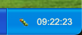

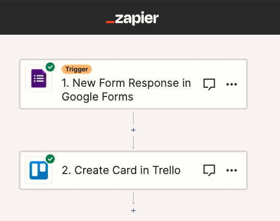

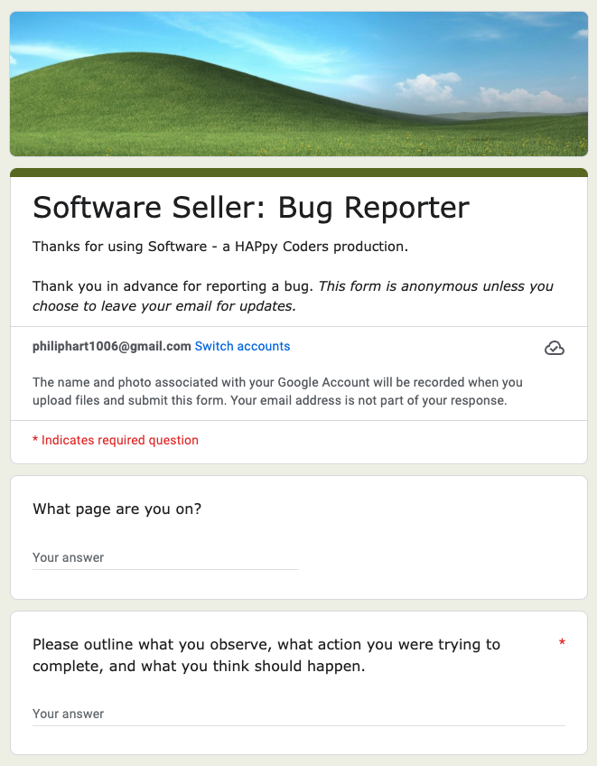

By deploying and sharing the link the night before presentations, we were able to demo a bug being reported, assigning the auto-generated card, and fixing it before re-deploying into production.

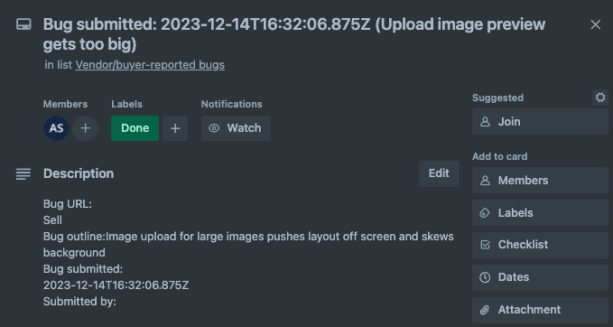

## Future Improvements

#### Remaining desired enhancements

* Mobile responsiveness: currently the minimum sized screen without breaking is iPad Mini
* Integrated payment functionality through Stripe. I had to leave a placeholder page instead as this wasn’t executed in the timeframe of the project.

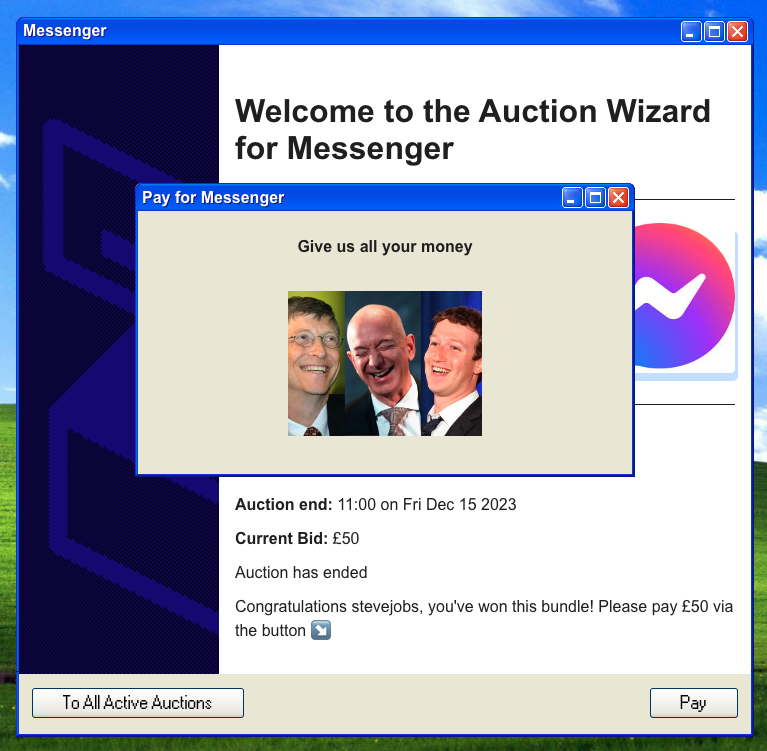

